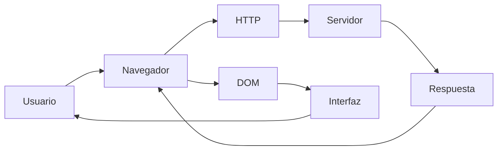
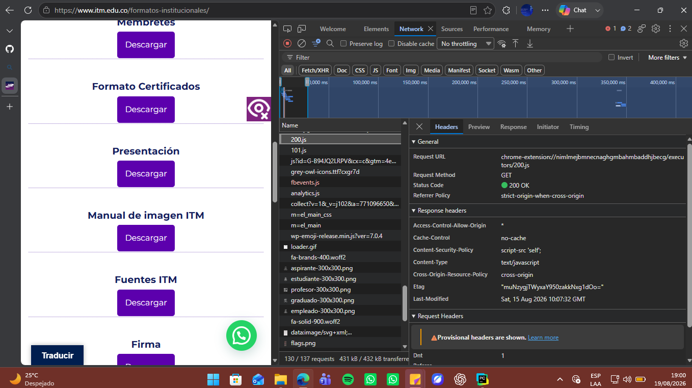
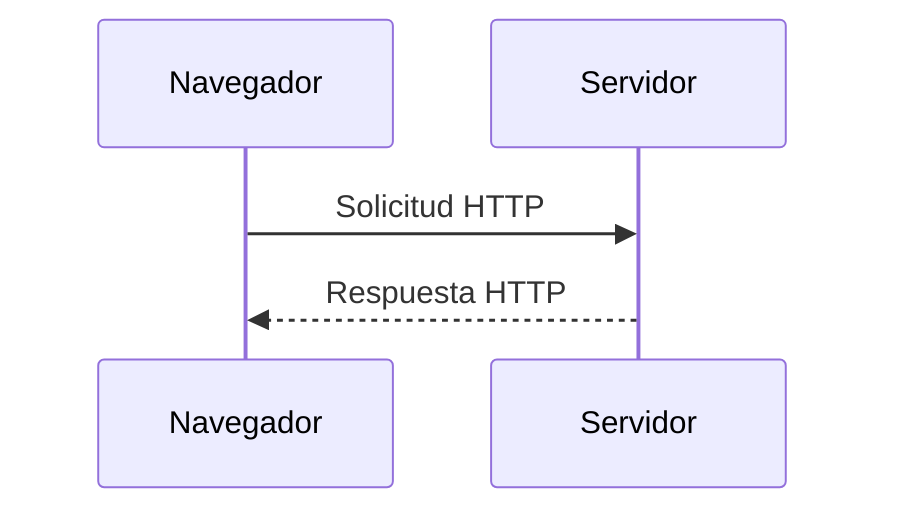
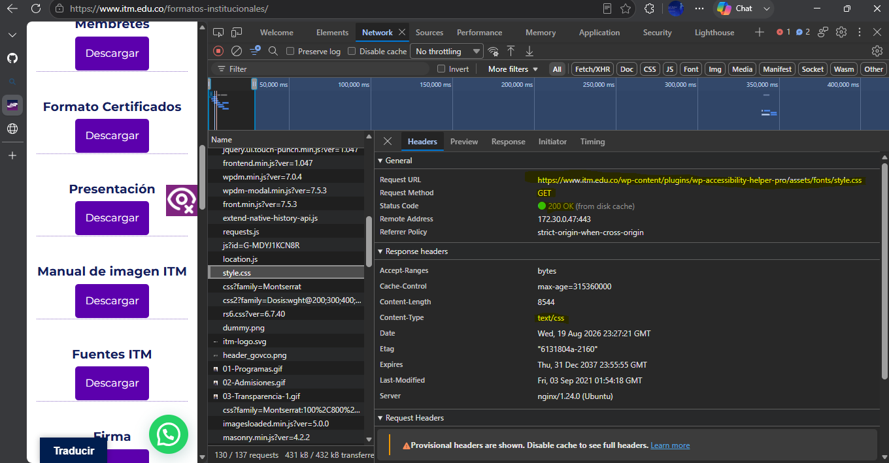
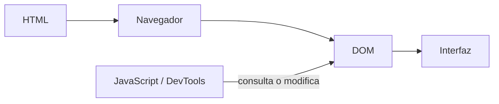
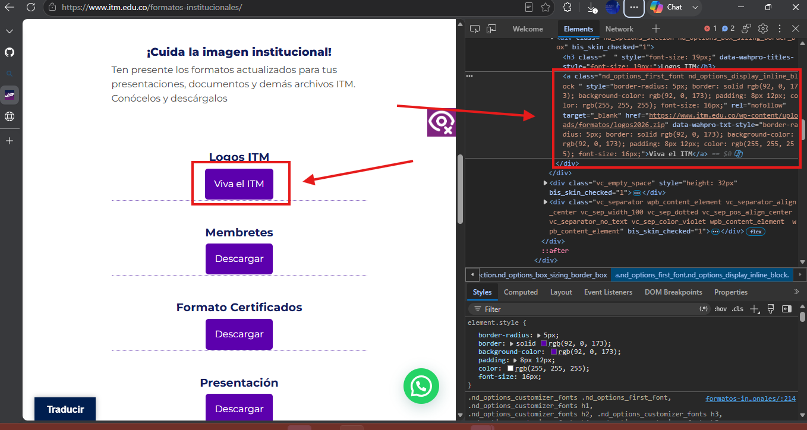
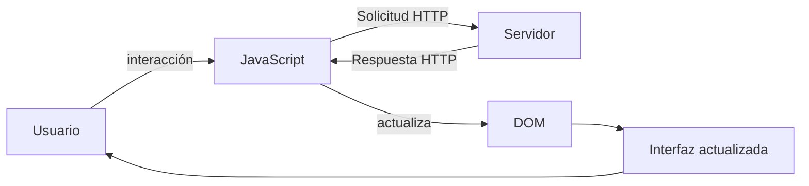
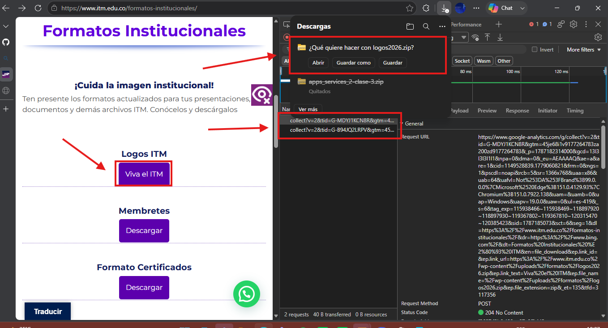
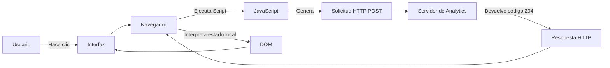

# Laboratorio 01 --- Análisis del funcionamiento de una aplicación web
## Por José Manuel Gutiérrez Sosa

> **Curso:** Aplicaciones y Servicios Web\
> **Modalidad:** Práctica de laboratorio\
> **Entrega:** Repositorio GitHub --- archivo `README.md`\
> **Evidencias:** Carpeta `evidencias/`

------------------------------------------------------------------------

## Objetivo de la práctica

Analizar el funcionamiento de una aplicación web real mediante las
herramientas de desarrollo del navegador, identificando los recursos
cargados, las solicitudes y respuestas HTTP, la estructura DOM y las
interacciones entre cliente y servidor.

## Resultado esperado

Al finalizar la práctica, el estudiante deberá poder reconstruir y
documentar el flujo observado entre:



> El diagrama anterior representa los **componentes que serán
> analizados**. El diagrama final de la práctica deberá ser construido
> por el estudiante a partir de sus propias observaciones.

------------------------------------------------------------------------

# 1. Preparación del entorno

1.  Ingrese a la aplicación web indicada por el docente.
2.  Abra las **herramientas de desarrollo** del navegador.
3.  Identifique las herramientas **Red / Network** y **Elementos /
    Elements**.
4.  Cree la siguiente estructura dentro del repositorio:

``` text
laboratorio-01/
├── README.md
└── evidencias/
```

El archivo `README.md` será el informe de la práctica. La carpeta
`evidencias/` contendrá las capturas utilizadas para sustentar los
resultados.

------------------------------------------------------------------------

# 2. Identificación de recursos de la aplicación

Abra la herramienta **Red / Network** y recargue completamente la
aplicación.

Observe las solicitudes generadas durante la carga e identifique como
mínimo **cinco recursos**, procurando seleccionar tipos diferentes:
documento HTML, CSS, JavaScript, imágenes, fuentes u otros.

## Resultados

Complete la tabla:

  Recurso |  Tipo  |  Dominio  |  Tamaño
  --------- ------ --------- --------
-  04-Investigacion.gif  |  GIF  |   https://www.itm.edu.co  |  107985                  
- Icono-Accesibilidad-3.png  |  Imagen PNG  |  https://www.itm.edu.co  |  3313
- facebook.svg  |  Imagen SVG  |  https://www.itm.edu.co/  |  695
- analytics.js  |  Archivo JS  |  https://www.google-analytics.com/  |  20802
- style.css  |  Archivo CSS  |  https://www.itm.edu.co/  |  8544
                           

**Total de solicitudes observadas:** `137`

## Evidencia

Guarde una captura de la pestaña Network como:

``` text
evidencias/network.png
```

Inclúyala aquí:

``` markdown

```

### Análisis

**¿Por qué una sola URL puede generar múltiples solicitudes HTTP?**

> Se debe a que la página puede requerir diferentes recursos que esten alojados en diferentes sitios, por ello requiere realizar varios llamados, para obtener la información necesaria para poder mostrarse correctamente.

------------------------------------------------------------------------

# 3. Análisis de una solicitud HTTP

En **Network**, seleccione una de las solicitudes realizadas por el
navegador, preferiblemente la correspondiente al documento principal.

Identifique la información solicitada a continuación.

  Elemento              Resultado
  --------------------- -----------
-  URL    https://www.itm.edu.co/wp-content/plugins/wp-accessibility-helper-pro/assets/fonts/style.css
-  Método HTTP    GET
-  Código de estado  200 OK
-  Host / dominio  https://www.itm.edu.co
-  Tipo de recurso   text/css
  Tiempo de respuesta   24 ms

## Flujo que se está observando



## Evidencia

Guarde una captura de los detalles de la solicitud como:

``` text
evidencias/request.png
```

Inclúyala en el informe:





### Análisis

**¿Qué recurso solicitó el navegador?**

> El navegador solicitó el recurso de estilos CSS para las fuentes usadas por la página.

**¿Qué información permite determinar si la solicitud fue atendida
correctamente?**

> Con el Status Code podemos determinar el resultado de la solicitud, como en este caso el Status Code fue 200, la solicitud fue procesada de forma exitosa.

------------------------------------------------------------------------

# 4. Inspección del DOM

Seleccione un elemento visible de la aplicación, por ejemplo:

-   un botón;
-   un título;
-   un enlace;
-   un campo de formulario;
-   un elemento del menú.

Utilizando **Elementos / Elements**:

1.  Localice el elemento dentro del DOM.
2.  Identifique la etiqueta HTML utilizada.
3.  Modifique temporalmente su contenido desde las herramientas de
    desarrollo.
4.  Observe el cambio producido en la interfaz.
5.  Registre la evidencia.

## Resultados

**Elemento seleccionado:** `Botón de "Descargar"`

**Etiqueta HTML:** `a`

**Contenido original:** `Descargar`

**Modificación realizada:** `Viva el ITM`

El proceso observado puede representarse conceptualmente así:



## Evidencia

Guarde la captura como:

``` text
evidencias/dom.png
```

Inclúyala aquí:





### Análisis

**¿La modificación realizada sobre el DOM alteró permanentemente la
aplicación o los archivos almacenados en el servidor? Justifique.**

> No, la modificación hecha en el DOM de la página solo modifica los datos cargados localmente, al recargar la página estos cambios se pierden y regresa a su estado original (la versión que vive en el servidor)

------------------------------------------------------------------------

# 5. Análisis de una interacción dinámica

Regrese a **Network** y limpie las solicitudes registradas.

Realice una acción dentro de la aplicación que pueda generar una
interacción con el servidor, por ejemplo:

-   consultar;
-   buscar;
-   filtrar;
-   seleccionar una opción;
-   enviar información.

Observe si aparece una nueva solicitud en Network.

## Resultados

  Elemento                       Resultado
  ------------------------------ -----------
  Acción realizada:     Pulsar botón de descargar
-  ¿Generó una nueva solicitud?  Sí 
-  URL solicitada:    
https://www.google-analytics.com/g/collect?v=2&tid=G-MDYJ1KCN8R&gtm=45je68i1v9177264783za200zd9177264783&_p=1787182314000&gcd=13l3l3l3l1l1&npa=0&dma=0&_eu=AEAAAAQ&ae=a&are=1&cid=1149528839.1779060821&frm=0&ngs=1&pscdl=noapi&rcb=5&sr=1366x768&uaa=x86&uab=64&uafvl=Not%253DA%253FBrand%3B99.0.0.0%7CMicrosoft%2520Edge%3B151.0.4129.93%7CChromium%3B151.0.7922.138&uam=&uamb=0&uap=Windows&uapv=19.0.0&uaw=0&ul=es-419&_s=6&tag_exp=115938466~115938469~118897920~118897930~119367802~119367810~120315470~120385423&sid=1787185073&sct=6&seg=1&dl=https%3A%2F%2Fwww.itm.edu.co%2Fformatos-institucionales%2F&dr=https%3A%2F%2Fwww.bing.com%2F&dt=Formatos%20Institucionales%20%E2%80%93%20ITM&en=file_download&ep.link_id=&ep.link_url=https%3A%2F%2Fwww.itm.edu.co%2Fwp-content%2Fuploads%2Fformatos%2Flogos2026.zip&ep.link_text=Viva%20el%20ITM&ep.file_name=%2Fwp-content%2Fuploads%2Fformatos%2Flogos2026.zip&ep.file_extension=zip&_et=135&tfd=3117356
- Método HTTP: POST                   
-  Código de estado: 204 No Content               
-  Tipo de respuesta: Descarga de archivo ZIP              

## Ciclo de interacción

Utilice este esquema únicamente como referencia conceptual para
interpretar lo observado:



## Evidencia

Guarde la captura como:

``` text
evidencias/interaccion.png
```

Inclúyala aquí:





### Análisis

**Explique la relación entre la acción realizada por el usuario y la
solicitud observada.**

> La solicitud observada no es el archivo descargándose, sino un evento de analíticas que se dispara en segundo plano al hacer clic. Sirve para registrar en las estadísticas de la web qué botón se presionó y qué archivo se descargó, devolviendo un estado 204 para confirmar que se recibió el dato sin interrumpir la navegación del usuario.

------------------------------------------------------------------------

# 6. Reconstrucción del flujo observado

A partir de **sus propias evidencias**, construya un diagrama Mermaid
que represente el funcionamiento de la aplicación analizada.

El diagrama deberá incluir, cuando corresponda:

`Usuario` · `Navegador` · `JavaScript` · `Solicitud HTTP` · `Servidor` ·
`Respuesta HTTP` · `DOM` · `Interfaz`

> **No copie los diagramas anteriores.** Esta sección debe representar
> el flujo que usted pudo comprobar durante la práctica.

Reemplace el siguiente bloque con su diagrama:



------------------------------------------------------------------------

# 7. Observado vs. inferido

Una herramienta de desarrollo permite observar una parte del sistema,
pero no necesariamente todo lo que ocurre en el servidor.

Clasifique sus hallazgos:

## Elementos observados directamente

-   Las solicitudes HTTP emitidas al cargar y operar la página web, incluyendo los métodos de solicitud (GET, POST) y los dominios o URL exactas.
-   El contenido de la estructura HTML original enviada y cómo el navegador construye y actualiza temporalmente el DOM a partir de esta.
-   Los códigos de estado retornados por cada servidor (como el 200 OK y el 204 No Content), los tiempos de carga (ej. 24 ms) y los tamaños de los recursos.

## Elementos inferidos

-   Que la descarga directa de un archivo .zip está gestionada tras bambalinas por código backend en los servidores propios, al cual no se tiene acceso para inspeccionar su lógica.
-   El procesamiento y almacenamiento de datos persistentes que Google Analytics realiza internamente con el payload (la carga útil) tras retornar el código 204.
-   La permanencia y estado real de los archivos de origen de la interfaz en los discos del servidor, deduciendo que la edición de un botón desde "Elements" no los modifica realmente.

> No presente como observado un proceso interno que las herramientas del
> navegador no permitan comprobar directamente.

------------------------------------------------------------------------

# 8. Conclusiones

Redacte **tres conclusiones técnicas** derivadas de la práctica.

1.  **Manipulación aislada del cliente (Frontend):** Las modificaciones ejecutadas a través del inspector del navegador sobre el DOM afectan de manera estricta al entorno local y temporal generado para la sesión del usuario. Esto pone de manifiesto la estructura de división de responsabilidades del modelo cliente-servidor; la manipulación del DOM no reescribe, ni compromete el estado en el que reside el archivo original en el servidor.
2.  **Arquitectura de recursos distribuidos:** Las trazas recabadas en la herramienta de Red indican que la carga exitosa y el despliegue funcional de un sitio web rara vez dependen de una sola conexión. Más bien, obedece a una orquestación en paralelo que solicita archivos CSS, JS, gráficas y servicios externos desde varios dominios, factor que evidencia el papel vital de cada componente en la presentación de la página.
3.  **Procesamiento de peticiones asíncronas:** Las operaciones dinámicas en las que el usuario participa no interrumpen forzosamente el flujo visual ni detonan una recarga completa de la ventana. En eventos como dar clic a un botón de descarga, funciones implementadas en JavaScript se ejecutan en segundo plano levantando peticiones asíncronas hacia componentes de análisis (evidenciado por la solicitud POST devuelta con un estatus *204 No Content*), facilitando la captura de métricas de forma silenciosa para el usuario.

Las conclusiones deben explicar lo aprendido a partir de la evidencia y
no limitarse a describir las actividades realizadas.

------------------------------------------------------------------------

# 9. Entrega

La estructura final esperada es:

``` text
laboratorio-01/
├── README.md
└── evidencias/
    ├── network.png
    ├── request.png
    ├── dom.png
    └── interaccion.png
```

Antes de entregar, verifique:

-   [x] El `README.md` se visualiza correctamente en GitHub.
-   [x] Las imágenes se muestran dentro del README.
-   [x] Se documentaron al menos cinco recursos.
-   [x] Se analizó una solicitud HTTP.
-   [x] Se identificó y modificó un elemento del DOM.
-   [x] Se analizó una interacción de la aplicación.
-   [x] El diagrama final corresponde a lo observado.
-   [x] Se diferenciaron elementos observados e inferidos.
-   [x] Se redactaron tres conclusiones técnicas.
-   [x] Se realizó `commit` y `push` al repositorio.

------------------------------------------------------------------------

## Criterio de documentación

> **Las capturas son evidencia, no la respuesta.**

Cada evidencia debe estar acompañada por una explicación que indique
**qué se observó, qué significa y cómo se relaciona con el
funcionamiento de la aplicación web**.